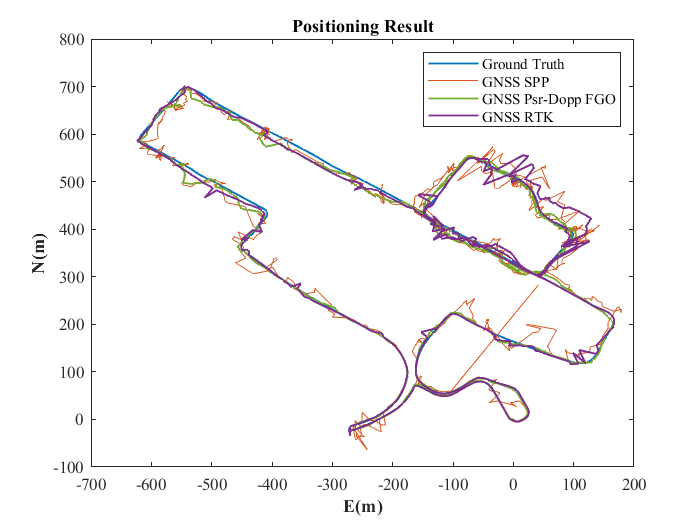
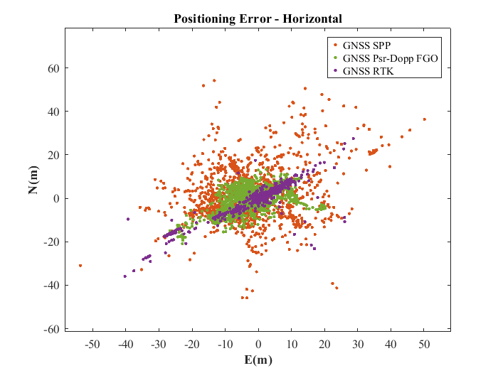

# GNSS Library Benchmarking on UrbanNav Dataset (Whampoa)

## Introduction
This repository presents a comparative analysis of three GNSS positioning libraries using the UrbanAv Whampoa dataset. The evaluation focuses on accuracy metrics and practical implementation considerations for urban navigation scenarios.

---

## Dataset Overview
- **Dataset**: UrbanNav-HK-Deep-Urban-1
- **Source**: [IPNL-POLYU/UrbanNavDataset](https://github.com/IPNL-POLYU/UrbanNavDataset)
- **Characteristics**:
  - Deep urban environment with signal multipath challenges
  - Collection period: 2021-05-21 06:28:44 to 06:54:22 (GPS time)
  - Contains u-blox F9P rover data and base station measurements

---

## Evaluated Libraries
1. **GraphGNSSLib** (`psr_dopp_fusion`)
   - Pseudorange-Doppler fusion with Factor Graph Optimization (FGO)
2. **RTKLIB** (`pntpos`)
   - Standard single-point positioning
3. **RTKLIB** (`rtk`)
   - Real-Time Kinematic (RTK) solution

---

## Experimental Setup

### Prerequisites
####  **Ubuntu** and **ROS**
Ubuntu 64-bit 18.04, ROS melodic. [ROS Installation](http://wiki.ros.org/ROS/Installation). We only test it on Ubuntu 18.04 with ROS Melodic. 

####  **Ceres Solver**
Follow the following instructions to install Ceres-solver instead of using the latest version of Ceres-solver.

**Step 1**: Download the [Ceres-solver](https://github.com/weisongwen/GraphGNSSLib/tree/master/support_files) which is compatible with GraphGNSSLib. 

**Step 2**: make and install
```bash
sudo apt-get install cmake
# google-glog + gflags
sudo apt-get install libgoogle-glog-dev
# BLAS & LAPACK
sudo apt-get install libatlas-base-dev
# Eigen3
sudo apt-get install libeigen3-dev
# make Ceres-solver
mkdir ceres-bin
cd ceres-bin
cmake ../ceres-solver
sudo make -j4
sudo make test
sudo make install
```

####  **Extra Libraries**
```bash
sudo apt-get install ros-melodic-novatel-msgs
```

###  Build AAE6102-Laboratory
Clone the repository and catkin_make:
```bash
mkdir AAE6102-Laboratory/src
cd ~/AAE6102-Laboratory/src
mkdir result
git clone https://github.com/Gao-tech1/AAE6102-Laboratory.git
cd ../
# if you fail in the last catkin_make, please source and catkin_make again
catkin_make
source devel/setup.bash
catkin_make
```
(**if you fail in this step, try to find another computer with clean system or reinstall Ubuntu and ROS**)

### Configuration
Modify the following parameters in `rtklib.h`:
```c
/** Whampoa dataset reference positions **/
#define ref_lon    114.190305193    // Reference longitude (deg)
#define ref_lat    22.301575393     // Reference latitude (deg)
#define ref_alt    5.4704           // Reference altitude (m)

#define station_x  -2421567.8916    // Base station ECEF X (m)
#define station_y  5384910.5631     // Base station ECEF Y (m)
#define station_z  2404264.3943     // Base station ECEF Z (m)

#define start_gps_sec 453618        // Start time (2021-05-21 06:00:00)
#define end_gps_sec   457218        // End time (2021-05-21 07:00:00)
```
### Launch File Configuration
Configure dataublox_Whampoa_20210521.launch:

```xml
<!-- Data intro (ublox, GPS/BeiDou, 20210521)
This data is starts from the Whampoa -->
<launch>
    <!-- path of dataset -->
    <param name="roverMeasureFile" type="string" value="$(find global_fusion)/dataset/2021_0521_0607/UrbanNav_HK_Deep_Urban_ubloxf9p.obs" />
    <param name="baseMeasureFile" type="string" value="$(find global_fusion)/dataset/2021_0521_0607/hkqt141g.21o" />
    <param name="BeiDouEmpFile" type="string" value="$(find global_fusion)/dataset/2021_0521_0607/hkqt141g.21c" />
    <param name="GPSEmpFile" type="string" value="$(find global_fusion)/dataset/2021_0521_0607/hkqt141g.21n" />

    <param name="out_folder"      type="string" value="$(find global_fusion)/dataset/2021_0521_0607/rtklibResult.pos" />

    <node name="gnss_preprocessor_node" pkg="global_fusion" type="gnss_preprocessor_node" output="screen">
      <!-- GNSS positioning mode, 0: single, 1:DGPS/DGNSS, 2: kinematic -->
      <param name="mode"       type="int" value="2" />
      <!-- number of frequency (1:L1,2:L1+L2,3:L1+L2+L5) -->
      <param name="nf"      type="int" value="2" />
      <param name="soltype"  type="int" value="0" />
    </node>

      <!--<node name="psr_spp_dyna_auto_node" pkg="global_fusion" type="psr_spp_dyna_auto_node" output="screen" />-->
      <!--<node name="psr_doppler_car_rtk_node" pkg="global_fusion" type="psr_doppler_car_rtk_node" output="screen" />-->
      <!--<node name="psr_doppler_car_rtk_dyna_node" pkg="global_fusion" type="psr_doppler_car_rtk_dyna_node" output="screen" />-->
    <!-- open the Rviz together with the OpenStreetMap -->
    <node pkg="rviz" type="rviz" name="rviz" output="screen" 
      args="-d $(find global_fusion)/rviz/gnss_positioning.rviz" required="true">
    </node>
    <node pkg="rostopic" type="rostopic" name="fake_gps_fix" args="pub /gps/fix sensor_msgs/NavSatFix --latch --file=$(find rviz_satellite)/launch/demo_Whampoa.gps" />
    <!-- Static fake TF transform -->
    <node pkg="tf2_ros" type="static_transform_publisher" name="static_tf_fake" args="0 0 0 0 0 0 map base_link" />
    <node pkg="tf2_ros" type="static_transform_publisher" name="static_tf_fake_m2w" args="0 0 0 0 0 0 map world" />

</launch>
```


---


## Results Analysis

### Accuracy

The accuracy of each library is measured by the following metrics:

- **RMSE (m)**: The Root Mean Squared Error in the East, North, and 2D directions.


| RMSE               | E (m)   | N (m)   | 2D (m)  |
|-----------------------|---------|---------|---------|
| **RTKLIB(pntpos)**    | 12.1895573326334|	13.3682392502478| 18.0912998045310  |
| **RTKLIB(RTK)**        |  7.76423626516391|	5.84354258952122	|9.71752822361916 |
| **GraphGNSSLib(psr_dopp_fusion)**  | 7.63169451428707	|5.35522177698531	|9.32315190480650 |

**Key observations:**

- *GraphGNSSLib*'s FGO approach shows 48.98% improvement in 2D accuracy over pntpos
- RTK mode reduces East error by 26.286% compared to single-point positioning
- The results show that the **psr_dopp_fusion** with *GraphGNSSLib* performs best in terms of accuracy, with the lowest mean error and RMSE across all directions. The **RTK** library follows closely, with better performance than **pntpos**.

**Performance Visualization**
Positioning Results | Positioning Errors
--- | ---
 | 

---

## Comparative Evaluation
### **Strengths**:
### 1. **Accuracy**

Accuracy is essential for any GNSS solution. Based on the results above, we can conclude the following:

- **psr_dopp_fusion**: The most accurate library across all dimensions (East, North, and 2D).
- **RTK**: Provides reasonably accurate results, but not as precise as **psr_dopp_fusion**.
- **pntpos**: Shows higher mean errors and RMSE, making it the least accurate among the three.

### 2. **Ease of Use**

- **pntpos** (RTKLIB): Generally considered easier to use due to its straightforward implementation.
- **rtk** (RTKLIB): Similarly easy to use but requires base station dataset for precise setups.
- **psr_dopp_fusion** (GraphGNSSLib): Requires more in-depth setup, but provides more flexibility for advanced use cases.
 
Overall, **RTKLIB** with GUI is easier for beginner GNSS users, while **GraphGNSSLib** is more suited for advanced users who need customization.

### 3. **Flexibility**

- **psr_dopp_fusion**: Offers greater flexibility, particularly in terms of sensor fusion and integration with other GNSS solutions.
- **rtk**: More rigid but highly optimized for real-time applications.
- **pntpos**: Less flexible compared to the other two but suitable for standard GNSS applications.

### 4. **Robustness**
- **psr_dopp_fusion**: The use of Factor Graph Optimization enhances the system's resilience to measurement noise and environmental factors, providing reliable results even under adverse conditions.
- **rtk**: RTK maintains accuracy robustness under varying conditions and can effectively handle multipath and other common GNSS errors.
- **pntpos**: Easy to use and still providing reasonable accuracy for many applications, it is a reliable choice for fast positioning needs.

### **Limitations**:
### 1. **Computational Efficiency**

- **psr_dopp_fusion**: The optimization processes can be computationally intensive, potentially requiring significant processing power, especially for real-time applications.
- **rtk**: While offering high accuracy, the computational demands can increase, particularly with larger datasets and more complex configurations.
- **pntpos**: Generally efficient for quick calculations, but lacks the advanced capabilities needed for high-precision applications, which may lead to performance bottlenecks in demanding scenarios.

### 2. **Lack of Specific Features**

- **psr_dopp_fusion**: Lack some advanced functionalities found in commercial GNSS solutions, which could limit its applicability in specialized scenarios.
- **rtk**: It's robust, but it doesn't include certain specialized features that are present in proprietary software, requiring users to seek additional resources for specific needs.
- **pntpos**: As a basic positioning solution, it doesn't provide the advanced features necessary for high-accuracy applications, so it may need additional tools.

---

## Conclusion

- **Best Accuracy**: The **psr_dopp_fusion** library stands out in terms of accuracy, both in mean error and RMSE.
- **Best Flexibility**: **psr_dopp_fusion** provides greater flexibility and better fusion capabilities for advanced users.
- **Best Ease of Use**: **pntpos** is the easiest to implement for basic GNSS needs.
- **Best Robustness**: **psr_dopp_fusion** uses pseudorange and Doppler information to improve accuracy and robustness in dynamic environments.

Given these factors, the choice of library will depend on your specific application requirements. If the focus is on accuracy and computational efficiency, **rtk** is the best choice. For more complex scenarios that require sensor fusion, **psr_dopp_fusion** would be a better option. For simpler GNSS applications, **pntpos** may be sufficient.

---

## References

- [UrbanavDataset](https://github.com/IPNL-POLYU/UrbanNavDataset)
- [GraphGNSSLIB Documentation](https://github.com/weisongwen/GraphGNSSLib)
- [RTKLIB Documentation](https://github.com/tomojitakasu/RTKLIB)


