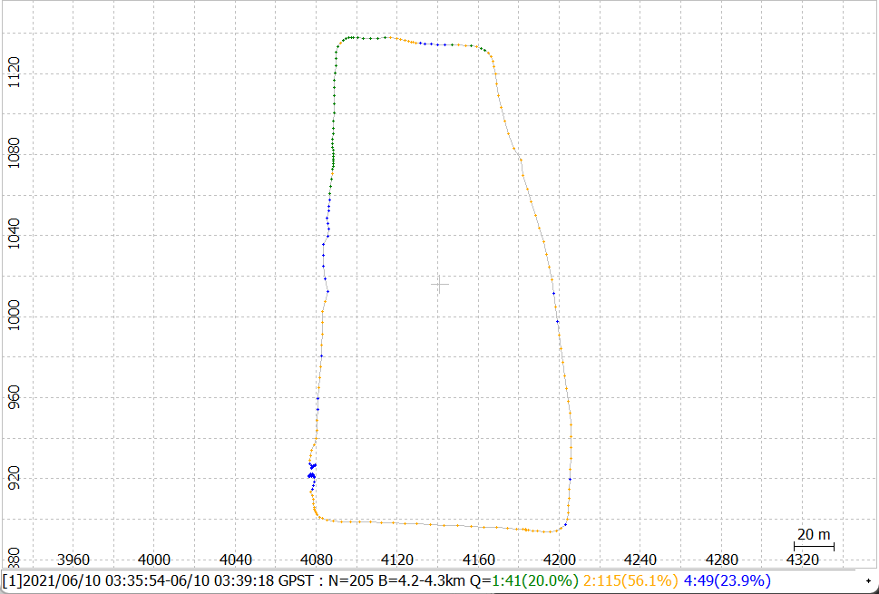

# AAE6102 Laboratory Report

### Report Menu
1. [Parameter Tuning and Effects](#1-parameter-tuning-and-effects)
2. [Strengths and Limitations](#2-strengths-and-limitations)
3. [Kaggle Competition](#3-kaggle-competition)
4. [Comparison with Other Libraries (Optional)](#4-comparison-with-other-libraries-optional)
5. [Suggestions for Improvement](#5-suggestions-for-improvement)

## 1. Parameter Tuning and Effects
- List the parameters tuned.
- Explain how parameter changes affected:
    - **Accuracy**
    - **Processing speed**
    - **Robustness**

### 1.1 pos1-frequency 
#### 1.1.1 Dynamic Data

    <table>
        <tr>
            <td align="center"> L1</td>
            <td align="center"> L1+L2/E5b</td>
            <td align="center"> L1+L2/E5b + L5/E5a+L6</td>
        </tr>
    </table>

#### 1.1.2 UrbanNav - Medium

    <table>
        <tr>
            <td align="center"> L1</td>
            <td align="center"> L1+L2/E5b</td>
            <td align="center"> L1+L2/E5b + L5/E5a+L6</td>
        </tr>
    </table>

#### 1.1.3 Conclusion
> L1 corresponds to a single frequency receiver, L1 + L2 corresponds to a dual frequency GPS/GLONASS/Bediou receiver, and if Galileo is included in the data, L1 + L2 + E5b is selected.

### 1.2 pos1-elmask
#### 1.2.1 Dynamic Data

    <table>
        <tr>
            <td align="center"> 0 degree</td>
            <td align="center"> 15 degree</td>
            <td align="center"> 30 degree</td>
            <td align="center"> 35 degree</td>
        </tr>
    </table>

    <table>
        <tr>
            <td align="center"> 40 degree</td>
            <td align="center"> 45 degree</td>
            <td align="center"> 50 degree</td>
            <td align="center">= 55 degree" style="width: 100%; height: auto;"> >= 55 degree</td>
        </tr>
    </table>

#### 1.2.2 UrbanNav - Medium

    <table>
        <tr>
            <td align="center"> 0 degree</td>
            <td align="center"> 15 degree</td>
            <td align="center"> 30 degree</td>
            <td align="center"> 35 degree</td>
        </tr>
    </table>

    <table>
        <tr>
            <td align="center"> 40 degree</td>
            <td align="center"> 45 degree</td>
            <td align="center">= 55 degree" style="width: 100%; height: auto;"> >= 55 degree</td>
        </tr>
    </table>

#### 1.2.3 Conclusion
> elmask is used to calculate the minimum satellite elevation of the position. I usually set it to 10-15 degrees to reduce the chance of introducing multipath into the solution, but this setting will depend on the mobile station environment. The more open the sky view, the lower this value can be set. In Dynamic dataset, it reach best performance when elmask set to 45 degree.

### 1.3 pos1-Filter type
#### 1.3.1 Dynamic Data

    <table>
        <tr>
            <td align="center"> forward</td>
            <td align="center"> backward</td>
            <td align="center"> combined</td>
            <td align="center"> combined - no phase reset</td>
        </tr>
    </table>

#### 1.3.2 UrbanNav - Medium

    <table>
        <tr>
            <td align="center"> forward</td>
            <td align="center"> backward</td>
            <td align="center"> combined</td>
            <td align="center"> combined - no phase reset</td>
        </tr>
    </table>

#### 1.3.3 Conclusion

> Filter type Indicates the filtering direction using Kalman filtering. When processing in real time, forward is your only option. For post-processing, the combined performs a forward filter, a backward filter and then combines the results. For an epoch, if the filter in both directions of the epoch corresponds to a fixed solution, then the combined result corresponds to a fixed solution state, and the value takes the mean of the two fixed solutions, unless the difference between the two is too great, in which case the solution state will be a floating point solution. If there is a fixed solution in only one direction, the value of this fixed solution is taken and the state is fixed. If both directions are floating solutions, take their average and the state will be a floating solution. The combined pattern is not always better, because fixing errors in either direction usually results in the combined result being a floating-point solution and incorrect. The main advantage of combined is that it usually provides a fixed solution at the beginning of the data, whereas the forward-only mode alone takes a while to converge.

### 1.4 pos1-SNR Mask
#### 1.4.1 Dynamic Data

    <table>
        <tr>
            <td align="center"> </td>
            <td align="center"> </td>
            <td align="center"> </td>
            <td align="center"> </td>
        </tr>

    <table>
        <tr>
            <td align="center"> </td>
            <td align="center"> </td>
            <td align="center"> </td>
            <td align="center"> </td>
        </tr>
    </table>

#### 1.4.2 UrbanNav - Medium

    <table>
        <tr>
            <td align="center"> </td>
            <td align="center"> </td>
            <td align="center"> </td>
            <td align="center"> </td>
        </tr>
    </table>

    <table>
        <tr>
            <td align="center"> </td>
            <td align="center"> </td>
            <td align="center"> </td>
            <td align="center"> </td>
        </tr>
    </table>

#### 1.4.3 Conclusion
> SNR Mask is used to set the SNR threshold for every 5 degrees of elevation. It is common to leave all values unchanged and choose a value between 35 and 38 dB based on the nominal SNR. These values are used only when pos1-snrmask_x is set to on. If you use dual frequency, you also need to set pos1-snrmask_L2.

### 1.5 pos1-RAIM FDE
#### 1.5.1 Dynamic Data

    <table>
        <tr>
            <td align="center"> RAIM FDE OFF</td>
            <td align="center"> RAIM FDE ON</td>
        </tr>
    </table>

#### 1.5.2 UrbanNav - Medium

    <table>
        <tr>
            <td align="center"> RAIM FDE OFF</td>
            <td align="center"> RAIM FDE ON</td>
        </tr>
    </table>

#### 1.5.3 Conclusion
> If a satellite's residual exceeds the threshold, it is excluded. Only those satellites with large errors will be excluded here, but the amount of computation will increase and the time will increase after enabling this option, so this option is usually disabled.

## 2. Strengths and Limitations
- **Strengths**: Flexibility, robustness, ease of use.
- **Limitations**: Computational efficiency, lack of specific features.

## 3. Kaggle Competition
Submit your positioning result and beat your classmate at [Kaggle competition](https://www.kaggle.com/competitions/aae-6102-laboratory/).

## 4. Comparative Evaluation
### **Strengths**:
### 1. **Accuracy**

Accuracy is essential for any GNSS solution. Based on the results above, we can conclude the following:

- **psr_dopp_fusion**: The most accurate library across all dimensions (East, North, and 2D).
- **RTK**: Provides reasonably accurate results, but not as precise as **psr_dopp_fusion**.
- **pntpos**: Shows higher mean errors and RMSE, making it the least accurate among the three.

### 2. **Ease of Use**

- **pntpos** (RTKLIB): Generally considered easier to use due to its straightforward implementation.
- **rtk** (RTKLIB): Similarly easy to use but requires base station dataset for precise setups.
- **psr_dopp_fusion** (GraphGNSSLib): Requires more in-depth setup, but provides more flexibility for advanced use cases.
 
Overall, **RTKLIB** with GUI is easier for beginner GNSS users, while **GraphGNSSLib** is more suited for advanced users who need customization.

### 3. **Flexibility**

- **psr_dopp_fusion**: Offers greater flexibility, particularly in terms of sensor fusion and integration with other GNSS solutions.
- **rtk**: More rigid but highly optimized for real-time applications.
- **pntpos**: Less flexible compared to the other two but suitable for standard GNSS applications.

### 4. **Robustness**
- **psr_dopp_fusion**: The use of Factor Graph Optimization enhances the system's resilience to measurement noise and environmental factors, providing reliable results even under adverse conditions.
- **rtk**: RTK maintains accuracy robustness under varying conditions and can effectively handle multipath and other common GNSS errors.
- **pntpos**: Easy to use and still providing reasonable accuracy for many applications, it is a reliable choice for fast positioning needs.

### **Limitations**:
### 1. **Computational Efficiency**

- **psr_dopp_fusion**: The optimization processes can be computationally intensive, potentially requiring significant processing power, especially for real-time applications.
- **rtk**: While offering high accuracy, the computational demands can increase, particularly with larger datasets and more complex configurations.
- **pntpos**: Generally efficient for quick calculations, but lacks the advanced capabilities needed for high-precision applications, which may lead to performance bottlenecks in demanding scenarios.

### 2. **Lack of Specific Features**

- **psr_dopp_fusion**: Lack some advanced functionalities found in commercial GNSS solutions, which could limit its applicability in specialized scenarios.
- **rtk**: It's robust, but it doesn't include certain specialized features that are present in proprietary software, requiring users to seek additional resources for specific needs.
- **pntpos**: As a basic positioning solution, it doesn't provide the advanced features necessary for high-accuracy applications, so it may need additional tools.

---

## 5. Suggestions for Improvement

### Recommandations for our used library:
**RTKLIB (tested on Ubuntu & Windows):**
- **Cross-Platform Consistency**: 

    RTKLIB operates on both Ubuntu and Windows, but inconsistencies in path formatting and file system handling can affect usability. Standardizing these behaviors would ensure a smoother cross-platform experience.
- **Lack of GUI on Ubuntu**: 

    Unlike the Windows version (which includes RTKNAVI, RTKPOST, etc.), the Ubuntu version lacks any graphical interface. Introducing a cross-platform GUI or web-based frontend would greatly improve usability, especially for configuration and debugging.
- **Multipath Mitigation**: 

    RTKLIB could be significantly improved by integrating modern multipath rejection and NLOS (Non-Line-of-Sight) detection techniques to boost positioning performance in urban and obstructed environments.
- **Codebase Modernization**: 

    Transitioning from C to a more modular C++ design with object-oriented principles would enhance maintainability and scalability.

**GraphGNSSLib (Docker-based):**

- **Docker Optimization**: 

    While the Docker setup is functional, it is not robust across different environments, often causing installation issues. Additionally, many users reported failures when starting the Docker container. Streamlining the Docker image and improving setup scripts would enhance reliability.
- **No GUI Support**: 

    GraphGNSSLib lacks a graphical interface under Ubuntu, making parameter tuning and debugging less intuitive. A lightweight Qt or web-based GUI for configuration would be highly beneficial, especially for beginners.
- **ROS Compatibility Limitation**: 

    GraphGNSSLib currently does not support ROS Noetic or later versions due to the missing `novatel_msgs` package. Updating dependencies or removing the reliance on deprecated packages is necessary for future ROS compatibility.
- **Scalability**: 

    Introducing multi-threaded computation and GPU-accelerated backends could help handle large datasets and improve performance in real-time applications.
- **Documentation and Examples**: 

    Expanding the documentation with practical examples, setup guides, and detailed parameter explanations would significantly lower the learning curve and promote adoption.

### Refining Parameter Tuning Process

- **Automated Search Tools**: Integrate support for automated hyperparameter optimization using methods like grid search or Bayesian optimization to streamline the tuning process.
- **Performance Evaluation Scripts**: Provide standardized tools to evaluate configurations based on metrics such as RMSE, fix ratio, convergence time, and computation time.
- **Environment-Specific Presets**: Include pre-configured parameter sets for common scenarios (e.g., open-sky, suburban, urban canyon) to help users quickly adapt to different conditions.
- **Visualization Support**: Add visualization utilities to analyze trajectory results, residuals, satellite geometry, and measurement quality, aiding in comprehensive evaluation.
- **Logging and Reproducibility**: Ensure all configuration files, parameter sets, and outputs are properly logged and version-controlled to support reproducibility and debugging.
